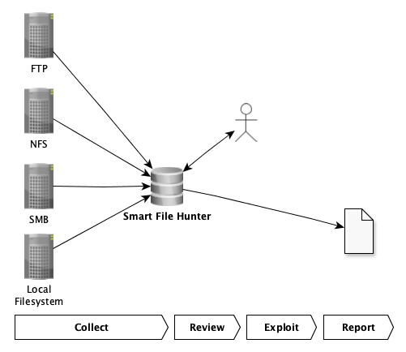

# Smart File Hunter

Smart File Hunter's (SFH) objective is the efficient identification of files, which contain potential sensitive
information like passwords, private keys, virtual machines, etc. Thereby, SFH supports searching the following sources:
 - File Transfer Protocol (FTP) services
 - Network File System (NFS) services
 - Samba Message Block (SMB) network shares
 - Local directories

In addition, it provides a review platform, which allows the analysis and classification of the identified files into
relevant and irrelevant. Finally, for reporting purposes, the identified relevant files can be exported into a CSV or
Microsoft Excel file. The process is documented in the following figure:




## Setup

First, clone the SFH repository to the directory `/opt/smartfilehunter`:

```bash
$ sudo git clone https://github.com/chopicalqui/SmartFileHunter.git /opt/smartfilehunter
```

SFH uses a relational database to store and organize the collected data. Thereby, SFH supports the following two
relational database management systems (RDMS):
 - **SQLite**: SQLite is sufficient for analyzing a single file sharing service at a time as SQLite is not designed
     for a high level of write concurrency. Per default, SFH uses SQLite.
 - **PostgreSQL**: If SFH is used for multiple collections in parallel, then PostgreSQL should be the preferred
    choice as it supports a high level of write concurrency.

### Docker Installation (recommended)

In order to use SFH in a Docker environment, follow the following configuration steps:

 - **[mandatory]** After cloning the SFH repository (see above), build the Docker container by executing the following
 commands:
 
    ```bash
    $ cd /opt/smartfilehunter
    $ sudo docker-compose build
    ```
 
 - **[optional]** If you want to use PostgreSQL (default is SQLite), then you have to set it up first. In addition,
 you have to update the following configuration items in
 [/opt/smartfilehunter/sfh/config/database.config](https://github.com/chopicalqui/SmartFileHunter/blob/main/sfh/config/database.config):
   - In section `[database]`, update item `active` from `sqlite` to `postgresql`
   - In section `[postgresql_production]`, update the configuration items accordingly:
     
     - `host`: The IP address/host name where the PostgreSQL database is running (default is localhost).
     - `port`: The TCP port on which the PostgreSQL service is listening (default is 5432).
     - `database`: The database name (default is filehunter).
     - `username`: The database user (default is filehunter).
     - `password`: The database user's password.
 
 - **[mandatory]** Initialize the database:
 
    ```bash
    $ sudo docker-compose run smartfilehunter -v db --init
    ```

 
### Manual Installation (export mode; you are on your own)

In order to manually install SFH, the following configuration steps must be executed:

 -  **[mandatory]** After cloning the SFH repository (see above), install the required Python3 packages:

    ```bash
    $ sudo pip3 install -r /opt/smartfilehunter/requirements.txt
    ```
    
    Note that this step might fail because pip is not able to install the module **libnfs**. In this case, you either
    use the Docker version or you have to manually install libnfs first (see content of
    [Dockerfile](https://github.com/chopicalqui/SmartFileHunter/blob/main/Dockerfile) for more information) and
    afterwards, you execute the command again.

 - **[mandatory]** Setup SFH. You can use the additional argument `--debug` to see the OS commands that the setup
 process is going to execute:
 
    ```bash
    $ sudo /opt/smartfilehunter/sfh/filehunter.py setup
    ```
    If you are working on a non-Debian operating system, then the above setup script is not able to automatically
    install the following libraries, which are required by the Python3 package `pyunpack`:
    - python3-magic
    - unzip
    - unrar
    - p7zip-full
    
    If these are packages are not installed, then SFH analyzes only ZIP archives.
    
 - **[mandatory]** Setup database. You can use the additional argument `--debug` to see the OS commands that the setup
 process is going to execute:
 
   a. For the setup of the **SQLite** database, execute the following setup command:
 
   ```bash
   $ filehunter setup --sqlite --tasks setup-database
   ```
   
   b. For the setup of the **PostgreSQL** database, execute the following setup command. Note that this command
   assumes that the PostgreSQL service is running on the local machine. If the command does not work, add argument
  `--debug` and manually modify and execute each command according to your environment:
 
   ```bash
   $ sudo filehunter setup --postgresql --tasks setup-database
   ```

 - **[mandatory]** Initialize the database (sudo is only required, if you use PostgreSQL):
 
    ```bash
    $ sudo filehunter -v db --init
    ```


## Collection

This section describes how SFH searches for interesting files. The search is based on so-called matching rules, which
are described in subsection *Matching Rules*. Thereby, each file undergoes a multi-staged analysis process, which is
described in subsection *Analysis Process*. Finally, SFH can perform this analysis process on files hosted on FTP,
SMB, or NFS services as well as on the local file system. The analysis process on these sources is described in
subsection *Supported Services*.

### Matching Rules
SFH performs searches based on rules, which are defined in the configuration file
[hunter.config](https://github.com/chopicalqui/SmartFileHunter/blob/main/hunter/config/hunter.config). Each rule has
the following attributes:
 - **search_location**: This attribute specifies whether the **search_pattern** (see below) is applied on the file's
 name or the file's content.
  - **search_pattern**: A [Python3 regular expression](https://docs.python.org/3/library/re.html) which, depending on
 the **search_location** is either applied on the file's name or content. Note that all search patters are case
 insensitive and that the search patterns on file contents also work on binary files, which for example allows the
 identification of sensitive information (e.g., connection strings) in application files (e.g., `.exe`).
 - **category**: A rule might belong to a category, which allows the automatic categorization of files that match the
 rule. Examples of categories are: Java files (e.g., `.war`), Configuration files (e.g., `.config`),
 email files (e.g., `.edb`), key files (e.g., `.ovpn`), password files (e.g., `.kdbx`), etc.
 - **relevance**: This attribute specifies the potential importance of a file matching a certain rule. Possible
 values are: low, medium, or high.
 
   For example, files that match the search pattern `^-+BEGIN.*?PRIVATE KEY-+` are most likely private keys that
 eventually can be used to compromise a host, whereas files just matching the search pattern `^.*\\.ini$` are
 configuration files with unknown and most likely irrelevant file content.
 - **accuracy**: This attribute specifies how specific the given **search_pattern** is.
   
   For example, the search pattern `^MSSQLBAK[\\W]+` is more specific as it describes the magic bytes of a Microsoft
   SQL Server backups, whereas the search pattern `^.*\\.bak` just specifies a potential backup file based on the file
   extension.

**I recommend reviewing the existing matching rules to gain a better understanding of what files SFH might identify.
Feedback for additional rules is always welcome!**

SFH applies the matching rules in a specific order. The order is based on a priority (rules with a priority come
first), which SFH automatically computes per rule by applying the following formula (`A` and `B`, where `A > B`, are
weighting factors to make **relevance** and **accuracy** more important than for example the **search_pattern**
length):

**search_location** + **relevance** * `A` + **accuracy** * `B` + character count of **search_pattern**

### Analysis Process

SFH recursively searches the given service (see next subsections) for relevant files. Thereby, it also
recursively extracts and analyzes the contents of archive files like ZIP, TAR, BZ2, etc. Which archives are
analyzed, is specified by the list ``supported_archives``, which is located in the configuration file
[hunter.config](https://github.com/chopicalqui/SmartFileHunter/blob/main/hunter/config/hunter.config).

For each identified file, SFH performs the following analysis steps:
  1. SFH determines the file's size and compares it to the internal threshold ``max_file_size_bytes``, which is located
  in configuration file
  [hunter.config](https://github.com/chopicalqui/SmartFileHunter/blob/main/hunter/config/hunter.config). You can
  deactivate the threshold by setting ``max_file_size_bytes`` to 0. Nevertheless, I do not recommend this configuration
  (see point 2).
  2. If the file's size is above this threshold (default is 67108864 bytes), then SFH does not download the file for
  the following reasons:
     - Speed up the analysis process.
     - Minimize impact on network performance.
     - Minimize impact on local memory and computation performance.
  As a result, SFH can only analyze the file name (including file extension) by applying the matching rules for
  file names (see **search_location** attribute in the previous section) to determine the file's potential relevance.
  If there is a match, then SFH stores the file path (without the file content) together with the matched rule in
  the database.
  3. If the file's size is below the threshold, then SFH downloads the file. Afterwards, it checks whether the file
  already exists in the database (based on the file content's SHA256 value):

     a. If it exists, then SFH just adds the current path to the database and continues with the next file.
     
     b. If it does not exist, then SFH applies the matching rules for file contents. If there is a match, then the
     search is stopped and SFH stores the file path together with the file content and the matched rule in the
     database for later review.
     
     c. If the file content did not match any match rule in Point 3b, then SFH applies the file name matching rules
     on the file's name. If there is a match, then SFH stores the file path together with the file content and
     the matched rule in the database for later review.
     
  4. If the file did not match any file content and file name rules, then the file is ignored and SFH repeats the
  process with the next file in the queue.

As previously described, the analysis is based on a sorted list of matching rules (match rules of a high priority come
first, see previous section). In case of a match, it is guaranteed that the rule with the highest quality
matched first and therefore nor further searches are required.


### Supported Services

One objective of SFH is supporting the majority of file sharing services so that an standardized enumeration
process can be applied on all files. This section describes the most important aspects per supported service.

Before you start a new engagement, you might want to re-initialize the database (arguments `--drop` and `--init`),
which will delete all previously collected data:
```bash
$ sudo docker-compose run smartfilehunter db --drop --init
```

Afterwards, a new workspace has to be created in the SFH database via the following command (variable `$ws` holds
the workspace name):

```bash
$ sudo docker-compose run smartfilehunter db -a $ws
```

Note that once the enumeration of a service is successfully completed, SFH marks this service as completed
in the database. Therefore, SFH is able to remember where the collection stopped and is able to continue the
enumeration without starting completely over again.

#### FTP

SFH's [FTP enumeration module](https://github.com/chopicalqui/SmartFileHunter/blob/main/sfh/hunters/modules/ftp.py)
uses the Python3 library [ftplib](https://docs.python.org/3/library/ftplib.html) to communicate with FTP services.
For the enumeration it uses the FTP command MLSD (Listings for Machine Processing), which is an extension to the
FTP protocol specified in [RFC 2659](https://tools.ietf.org/html/rfc3659). In other words, SFH cannot enumerate FTP
services at the moment, which do not support this command.

For more information about FTP enumeration, refer to the SFH help:

```bash
$ sudo docker-compose run smartfilehunter ftp -h
```

The following video shows an FTP enumeration example using
[SFH's test data](https://github.com/chopicalqui/SmartFileHunter/tree/main/testdata):


#### NFS

SFH's [NFS enumeration module](https://github.com/chopicalqui/SmartFileHunter/blob/main/sfh/hunters/modules/nfs.py)
uses the Python3 library [libnfs](https://github.com/sahlberg/libnfs-python/) to communicate with NFS services.

For more information about NFS enumeration, refer to the SFH help:

```bash
$ sudo docker-compose run smartfilehunter nfs -h
```

The following video shows an NFS enumeration example using
[SFH's test data](https://github.com/chopicalqui/SmartFileHunter/tree/main/testdata):


#### SMB

SFH's [SMB enumeration module](https://github.com/chopicalqui/SmartFileHunter/blob/main/sfh/hunters/modules/smb.py)
uses the Python3 library [impacket](https://github.com/SecureAuthCorp/impacket) to
communicate with SMB services. Therefore, SFH supports the following authentication options:
 - Authentication via username and password
 - Authentication via username and hash
 - No authentication (SMB NULL sessions)

For more information about NFS enumeration, refer to the SFH help:

```bash
$ sudo docker-compose run smartfilehunter smb -h
```

The following video shows an SMB enumeration example using
[SFH's test data](https://github.com/chopicalqui/SmartFileHunter/tree/main/testdata):


#### Local Filesystem

In some cases, the enumeration of local files might be necessary. Possible examples are:
 - After downloading large volumes of data from a web application via wget.
 - Mounting services that are not yet supported by SFH (e.g., via SSHFS).

In this case, SFH's
[local directory enumeration module](https://github.com/chopicalqui/SmartFileHunter/blob/main/sfh/hunters/modules/local.py)
can be used.

For more information about local filesystem enumeration, refer to the SFH help:

```bash
$ sudo docker-compose run smartfilehunter local -h
```

The following video provides an example of a local filesystem enumeration via SSHFS using
[SFH's test data](https://github.com/chopicalqui/SmartFileHunter/tree/main/testdata):


## Review and Exploitation

After or during the collection, SFH supports the review of the collected files. Thereby, the reviewer can navigate
through the collected files and categorize them into irrelevant and relevant. Depending on the file's content, SFH
either displays the file content as text or hexdump (fallback).

SFH speeds up the review and reporting process by implementing the following features:
  - **Present files that matched a rule of higher relevance and accuracy first**: SFH presents the collected files in
  a pre-defined order starting with the ones with the highest relevance and accuracy (see section *Matching Rule*).
  - **Deduplication**: All files within a workspace are stored in the SFH database in a deduplicated manner.
  Therefore, once a file is categorized, it does not have to be categorized again, even if it is found in another
  location at a later time again.
  - **Commenting**: Add comments to each file during the review. The comment is part of the final CSV or Microsoft
  Excel file (see section *Reporting*), which can be incorporated into the final report.

You start the review by executing the following command, where variable `$ws` holds the name of the workspace:

```bash
$ sudo docker-compose run smartfilehunter review -w $ws
```

After the execution of the above command, SFH starts an interactive command prompt and displays the first file.
The interactive command prompt provides the following commands:
  - **comment**: Add the given comment to the current file.
  - **export**: Export current file to the given file path. Note that existing files will be overwritten without a
  warning.
  - **help**: Display all commands or additional information for a specific command.
  - **1**: Mark current file as relevant and display the next file.
  - **2**: Mark current file as irrelevant and display the next file.
  - **n**: Display next file.
  - **p**: Display previous file.
  - **q**: Quit review.
  - **refresh**: SFH does not automatically update the list of available files to ensure a consistent review behaviour.
  Use this command, if the collection is still going on, while you are doing the review and you want to obtain the
  latest files.
  - **set**: Allows updating the current workspace as well as the current review filter. The default filter only
  shows files that have not yet been reviewed.
 
Note: SFH remembers the last used command, which will be automatically repeated if you just hit enter. This is
for example, helpful, if you have a series of irrelevant files.

The following video provides an example of how the review can be conducted:


## Reporting

Finally, you can export the review results into a CSV or Microsoft Excel file. For more information about reporting,
refer to the SFH help:

```bash
$ sudo docker-compose run smartfilehunter report -h
```

The following video provides an example report about the previously identified relevant files:


## Author

**Lukas Reiter** ([@chopicalquy](https://twitter.com/chopicalquy)) - 
[Smart File Hunter](https://github.com/chopicalqui/SmartFileHunter)


## License

This project is licensed under the GPLv3 License - see the
[license](https://github.com/chopicalqui/SmartFileHunter/blob/master/LICENSE) file for details.